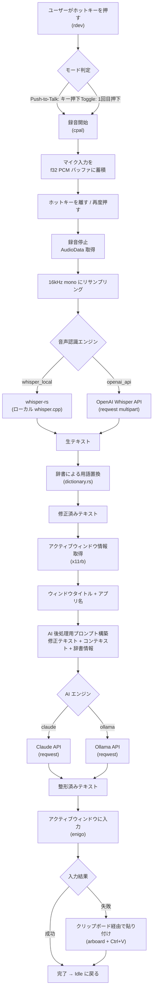
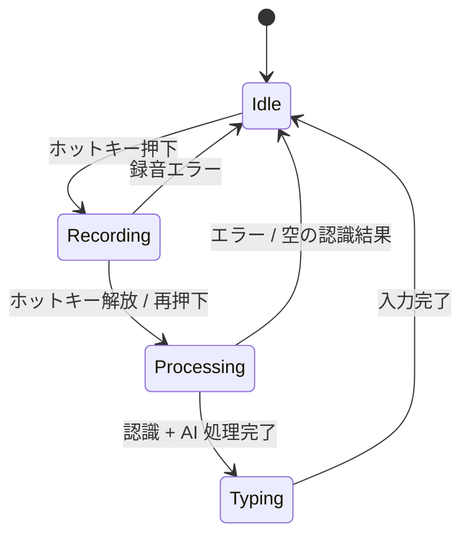

# koe - Ubuntu 音声入力システム

Whisper による高精度な音声認識 + AI による後処理で、コンテキストを理解した賢い音声入力を Ubuntu/Linux で実現する Rust 製ツール。

macOS の superwhisper / Aquavoice に相当するものを Linux で。

## 特徴

- **音声認識**: whisper.cpp（ローカル）/ OpenAI Whisper API（クラウド）切替可能
- **AI 後処理**: Claude API / Ollama（ローカル LLM）切替可能
- **コンテキスト認識**: アクティブウィンドウの情報を AI に渡して文脈に合った整形
- **辞書管理**: ドメイン固有の用語辞書で認識精度を向上
- **ホットキー**: Push-to-talk / トグル 両対応、キー設定変更可能
- **直接入力**: アクティブウィンドウにそのままタイプ入力

## 処理フロー



## 状態遷移



## アーキテクチャ

```
[Hotkey (rdev)] → [Audio Capture (cpal)] → [Speech Recognition] → [AI Post-Processing] → [Text Input (enigo)]
                                                    ↑                      ↑
                                            whisper-rs / OpenAI     Claude / Ollama
                                                                          ↑
                                                              [Context Capture (x11rb)]
                                                              [Dictionary Manager]
```

## 各モジュール

| ファイル | 役割 |
|---------|------|
| `src/main.rs` | イベントループ、状態管理 (Idle → Recording → Processing → Typing) |
| `src/config.rs` | TOML 設定ファイル読み込み |
| `src/audio.rs` | cpal によるマイク録音、16kHz リサンプリング、WAV エンコード |
| `src/recognition/whisper_local.rs` | whisper-rs によるローカル音声認識 |
| `src/recognition/openai_api.rs` | OpenAI Whisper API による音声認識 |
| `src/ai/claude.rs` | Claude API によるテキスト後処理 |
| `src/ai/ollama.rs` | Ollama によるテキスト後処理 |
| `src/context.rs` | x11rb でアクティブウィンドウのタイトル・クラスを取得 |
| `src/input.rs` | enigo による直接タイプ入力 + クリップボード貼り付けフォールバック |
| `src/hotkey.rs` | rdev によるグローバルホットキー (Push-to-Talk / Toggle) |
| `src/dictionary.rs` | TOML 辞書の読み込み・用語置換 |

## セットアップ

### 依存パッケージ

```bash
sudo apt install -y libasound2-dev libclang-dev libxkbcommon-dev \
  libx11-dev libxi-dev libxext-dev libxtst-dev libxfixes-dev cmake
```

### Whisper モデルのダウンロード

```bash
mkdir -p ~/.local/share/koe/models
wget -O ~/.local/share/koe/models/ggml-large-v3.bin \
  https://huggingface.co/ggerganov/whisper.cpp/resolve/main/ggml-large-v3.bin
```

### API キーの設定

```bash
# Claude を使う場合
export ANTHROPIC_API_KEY="your-key-here"

# OpenAI Whisper API を使う場合
export OPENAI_API_KEY="your-key-here"
```

### ビルド・実行

```bash
cargo build --release
./target/release/koe
```

## 設定 (config.toml)

```toml
[recognition]
engine = "whisper_local"  # "whisper_local" | "openai_api"

[recognition.whisper_local]
model_path = "~/.local/share/koe/models/ggml-large-v3.bin"
language = "ja"

[recognition.openai_api]
api_key_env = "OPENAI_API_KEY"
language = "ja"

[ai]
engine = "claude"  # "claude" | "ollama"

[ai.claude]
api_key_env = "ANTHROPIC_API_KEY"
model = "claude-sonnet-4-6-20250514"

[ai.ollama]
host = "http://localhost:11434"
model = "qwen2.5:14b"

[hotkey]
mode = "push_to_talk"  # "push_to_talk" | "toggle"
key = "Super_R"

[dictionaries]
paths = ["dictionaries/default.toml"]
```

## 辞書ファイル

`dictionaries/default.toml`:

```toml
[terms]
"ラスト" = "Rust"
"クロード" = "Claude"
"ウブンツ" = "Ubuntu"

[context_hints]
domain = "ソフトウェア開発"
notes = "プログラミング言語やツール名は英語表記を優先"
```

## 技術スタック

| 機能 | Crate |
|------|-------|
| 音声録音 | `cpal` |
| ローカル音声認識 | `whisper-rs` (whisper.cpp バインディング) |
| グローバルホットキー | `rdev` |
| キーボード入力 | `enigo` |
| X11 ウィンドウ情報 | `x11rb` |
| クリップボード | `arboard` |
| HTTP クライアント | `reqwest` (rustls) |
| 非同期ランタイム | `tokio` |
| 設定ファイル | `serde` + `toml` |
| ログ | `tracing` |
