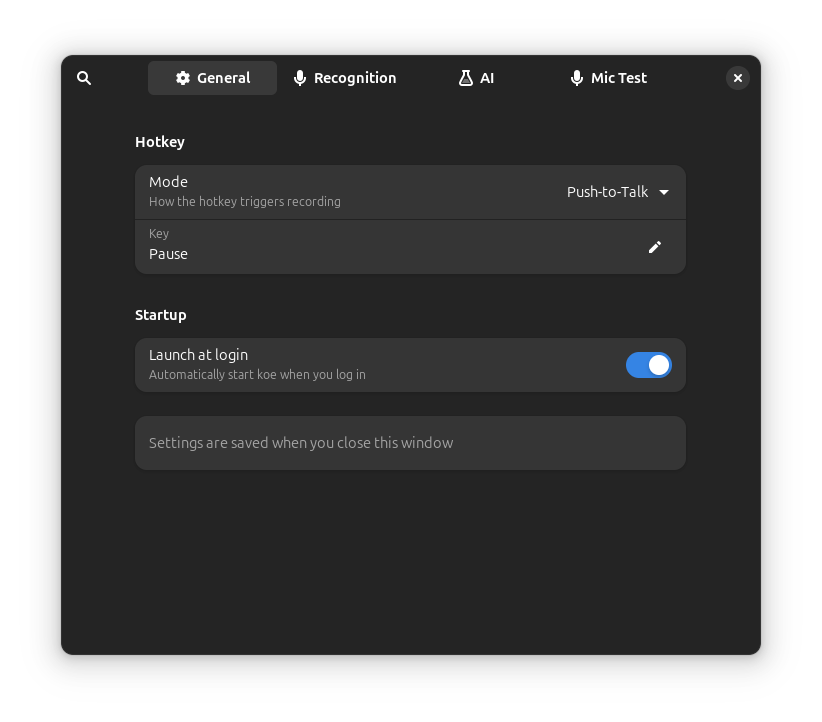
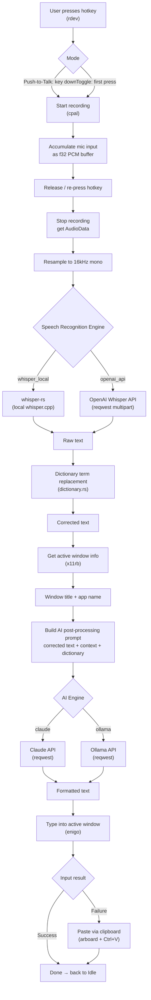
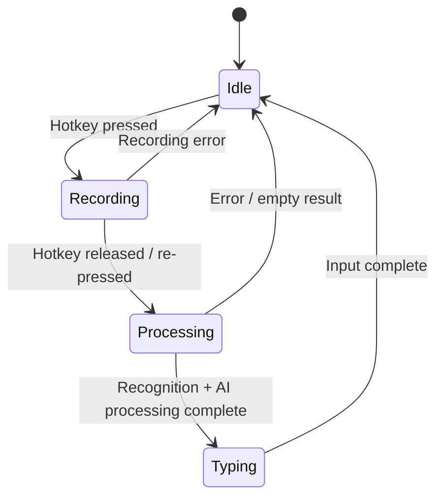

# koe

[](LICENSE)
[](https://www.rust-lang.org/)
[](https://ubuntu.com/)

**The voice input tool Linux has been missing — AI-powered, open source.**



## Why koe?

macOS has polished voice input tools with AI post-processing, but Linux has had no equivalent — just raw STT with no intelligence behind it.

**koe** fills that gap:

- **AI post-processing** — raw transcription is refined by an LLM that understands your context
- **Context-aware** — reads the active window title/app to tailor output (code comments in an editor, natural prose in a doc)
- **Fully local option** — whisper.cpp + Ollama means zero data leaves your machine
- **Built in Rust** — single binary, low latency, minimal resource usage
- **Dictionary support** — domain-specific term correction for accurate technical vocabulary

## Feature Comparison

| Feature | **koe** | nerd-dictation | Google Docs Voice | No voice input |
|---|---|---|---|---|
| AI post-processing | Yes (Claude / Ollama) | No | No | — |
| Context-aware formatting | Yes (active window) | No | No | — |
| Fully local operation | Yes (whisper.cpp + Ollama) | Yes | No | — |
| Custom dictionary | Yes | Yes (limited) | No | — |
| Hotkey modes | Push-to-talk + Toggle | Push-to-talk | Button | — |
| Direct typing to any app | Yes | Yes | Google Docs only | — |
| Language | Any (Whisper) | Any (Vosk) | Many | — |

## Features

- **Speech Recognition**: Switch between whisper.cpp (local) and OpenAI Whisper API (cloud)
- **AI Post-Processing**: Switch between Claude API and Ollama (local LLM)
- **Context Awareness**: Active window info is sent to the AI for context-appropriate formatting
- **Dictionary Management**: Domain-specific term dictionaries improve recognition accuracy
- **Hotkeys**: Push-to-talk and toggle modes with configurable key bindings
- **Direct Input**: Types directly into the active window, with clipboard fallback

## Processing Flow


```mermaid
flowchart TD
    A["User presses hotkey\n(rdev)"] --> B{Mode}
    B -->|Push-to-Talk: key down| C["Start recording\n(cpal)"]
    B -->|Toggle: first press| C

    C --> D["Accumulate mic input\nas f32 PCM buffer"]
    D --> E["Release / re-press hotkey"]
    E --> F["Stop recording\nget AudioData"]

    F --> G["Resample to 16kHz mono"]

    G --> H{Speech Recognition Engine}
    H -->|whisper_local| I["whisper-rs\n(local whisper.cpp)"]
    H -->|openai_api| J["OpenAI Whisper API\n(reqwest multipart)"]

    I --> K["Raw text"]
    J --> K

    K --> L["Dictionary term replacement\n(dictionary.rs)"]
    L --> M["Corrected text"]

    M --> N["Get active window info\n(x11rb)"]
    N --> O["Window title + app name"]

    O --> P["Build AI post-processing prompt\ncorrected text + context + dictionary"]

    P --> Q{AI Engine}
    Q -->|claude| R["Claude API\n(reqwest)"]
    Q -->|ollama| S["Ollama API\n(reqwest)"]

    R --> T["Formatted text"]
    S --> T

    T --> U["Type into active window\n(enigo)"]
    U --> V{Input result}
    V -->|Success| W["Done → back to Idle"]
    V -->|Failure| X["Paste via clipboard\n(arboard + Ctrl+V)"]
    X --> W
```

## State Machine


```mermaid
stateDiagram-v2
    [*] --> Idle
    Idle --> Recording : Hotkey pressed
    Recording --> Processing : Hotkey released / re-pressed
    Processing --> Typing : Recognition + AI processing complete
    Typing --> Idle : Input complete
    Processing --> Idle : Error / empty result
    Recording --> Idle : Recording error
```

## Architecture

```
[Hotkey (rdev)] → [Audio Capture (cpal)] → [Speech Recognition] → [AI Post-Processing] → [Text Input (enigo)]
                                                    ↑                      ↑
                                            whisper-rs / OpenAI     Claude / Ollama
                                                                          ↑
                                                              [Context Capture (x11rb)]
                                                              [Dictionary Manager]
```

## Modules

| File | Role |
|------|------|
| `src/main.rs` | Event loop, state management (Idle → Recording → Processing → Typing) |
| `src/config.rs` | TOML config file loading |
| `src/audio.rs` | Mic recording via cpal, 16kHz resampling, WAV encoding |
| `src/recognition/whisper_local.rs` | Local speech recognition via whisper-rs |
| `src/recognition/openai_api.rs` | Speech recognition via OpenAI Whisper API |
| `src/ai/claude.rs` | Text post-processing via Claude API |
| `src/ai/ollama.rs` | Text post-processing via Ollama |
| `src/context.rs` | Active window title/class capture via x11rb |
| `src/input.rs` | Direct typing via enigo + clipboard paste fallback |
| `src/hotkey.rs` | Global hotkey via rdev (Push-to-Talk / Toggle) |
| `src/dictionary.rs` | TOML dictionary loading and term replacement |

## Setup

### Dependencies

```bash
sudo apt install -y libasound2-dev libclang-dev libxkbcommon-dev \
  libx11-dev libxi-dev libxext-dev libxtst-dev libxfixes-dev cmake
```

### Download Whisper Model

```bash
mkdir -p ~/.local/share/koe/models
wget -O ~/.local/share/koe/models/ggml-large-v3.bin \
  https://huggingface.co/ggerganov/whisper.cpp/resolve/main/ggml-large-v3.bin
```

### API Keys

```bash
# If using Claude for AI post-processing
export ANTHROPIC_API_KEY="your-key-here"

# If using OpenAI Whisper API for recognition
export OPENAI_API_KEY="your-key-here"
```

### Build & Run

```bash
cargo build --release
./target/release/koe
```

## Configuration (config.toml)

```toml
[recognition]
engine = "whisper_local"  # "whisper_local" | "openai_api"

[recognition.whisper_local]
model_path = "~/.local/share/koe/models/ggml-large-v3.bin"
language = "ja"

[recognition.openai_api]
api_key_env = "OPENAI_API_KEY"
language = "ja"

[ai]
engine = "claude"  # "claude" | "ollama"

[ai.claude]
api_key_env = "ANTHROPIC_API_KEY"
model = "claude-sonnet-4-6-20250514"

[ai.ollama]
host = "http://localhost:11434"
model = "qwen2.5:14b"

[hotkey]
mode = "push_to_talk"  # "push_to_talk" | "toggle"
key = "Super_R"

[dictionaries]
paths = ["dictionaries/default.toml"]
```

## Dictionary File

`dictionaries/default.toml`:

```toml
[terms]
"ラスト" = "Rust"
"クロード" = "Claude"
"ウブンツ" = "Ubuntu"

[context_hints]
domain = "software development"
notes = "Prefer English for programming language and tool names"
```

## Tech Stack

| Function | Crate |
|----------|-------|
| Audio recording | `cpal` |
| Local speech recognition | `whisper-rs` (whisper.cpp bindings) |
| Global hotkey | `rdev` |
| Keyboard input | `enigo` |
| X11 window info | `x11rb` |
| Clipboard | `arboard` |
| HTTP client | `reqwest` (rustls) |
| Async runtime | `tokio` |
| Config file | `serde` + `toml` |
| Logging | `tracing` |
